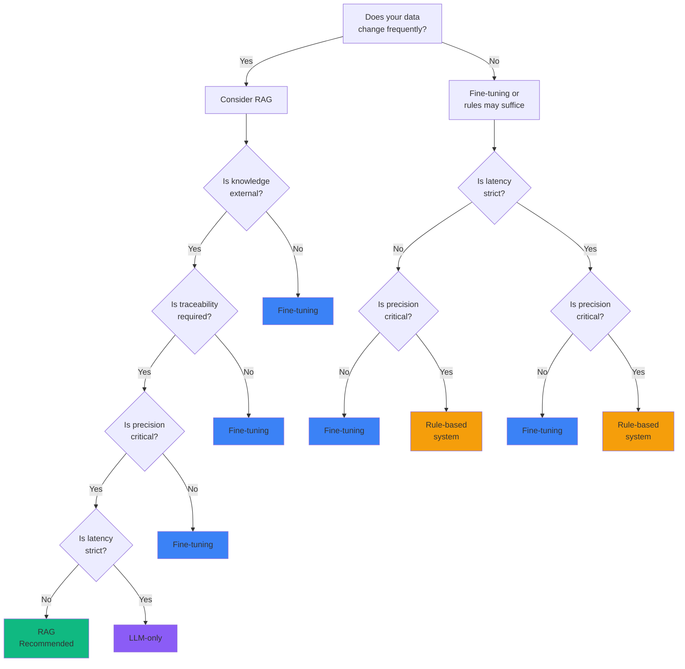

# When Should You Use RAG? A Practical Decision Framework

You're building an AI application and facing a critical question: **Should I use RAG, fine-tune a model, rely on prompt engineering, or just use rule-based logic?**

This isn't just a technical decision—it impacts your development timeline, operational costs, accuracy, and maintainability. Choose wrong, and you might spend months building the wrong solution.

This guide provides a **practical decision framework** with a clear flowchart to help you choose the right approach for your use case.

{/* truncate */}

## 🤔 The Four Approaches Explained

Before diving into the decision tree, let's understand what we're choosing between:

<div style={{display: 'grid', gridTemplateColumns: 'repeat(auto-fit, minmax(280px, 1fr))', gap: '1.5rem', margin: '2rem 0'}}>

<div style={{padding: '1.5rem', background: 'var(--ifm-background-surface-color)', border: '2px solid #10b981', borderRadius: '12px'}}>

### 🔍 RAG (Retrieval-Augmented Generation)

**What it is:** Dynamically fetch relevant information from external sources and feed it to an LLM for generation.

**Key characteristic:** Combines search + generation

</div>

<div style={{padding: '1.5rem', background: 'var(--ifm-background-surface-color)', border: '2px solid #3b82f6', borderRadius: '12px'}}>

### 🎯 Fine-Tuning

**What it is:** Train a pre-trained model on your specific data to adapt its behavior and knowledge.

**Key characteristic:** Bakes knowledge into model weights

</div>

<div style={{padding: '1.5rem', background: 'var(--ifm-background-surface-color)', border: '2px solid #8b5cf6', borderRadius: '12px'}}>

### 💬 LLM-Only (Prompt Engineering)

**What it is:** Use a pre-trained LLM with carefully crafted prompts, relying on its training data.

**Key characteristic:** Zero additional infrastructure

</div>

<div style={{padding: '1.5rem', background: 'var(--ifm-background-surface-color)', border: '2px solid #f59e0b', borderRadius: '12px'}}>

### ⚙️ Rule-Based Systems

**What it is:** Deterministic logic with if-then rules, regex patterns, and decision trees.

**Key characteristic:** Fully predictable and explainable

</div>

</div>

---

## 🗺️ The Decision Flowchart

Here's the complete decision framework created by **Mubashir-Ul-Hassan**:

<div style={{textAlign: 'center', margin: '2rem 0', padding: '2rem', background: 'var(--ifm-background-surface-color)', borderRadius: '12px'}}>

{/* TODO: Add decision flowchart image

*/}

*Decision tree for choosing between RAG, Fine-tuning, LLM-only, and Rule-based systems*

</div>

### Interactive Decision Tree

Here's an interactive version you can follow step-by-step:



---

## 🚶 Walking Through Each Decision Point

Let's break down each question in the flowchart with concrete examples.

### Question 1: Does Your Data Change Frequently?

<div style={{padding: '2rem', background: 'linear-gradient(135deg, rgba(16, 185, 129, 0.1) 0%, rgba(5, 150, 105, 0.1) 100%)', borderRadius: '12px', marginBottom: '2rem'}}>

**This is the first and most important question.** It determines whether you need dynamic knowledge access.

</div>

#### ✅ Data Changes Frequently → Consider RAG

**Examples:**
- **News aggregation**: Articles published hourly
- **Stock market data**: Prices change by the second
- **Product catalogs**: New items added daily
- **Documentation sites**: Docs updated with each release
- **Social media feeds**: Constant new content
- **Legal databases**: New cases and regulations regularly

**Why RAG?** Fine-tuning requires retraining every time data changes, which is expensive and slow. RAG fetches the latest information on-demand.

```python
# RAG can access today's information
query = "What are today's top tech news stories?"
# Retrieves from constantly updating news database
relevant_articles = vector_db.search(query, filter={"date": "2025-12-29"})
response = llm.generate(query, context=relevant_articles)
```

#### ❌ Data is Static → Fine-tuning or Rules May Suffice

**Examples:**
- **Medical diagnosis guidelines**: Updated yearly
- **Company policies**: Change quarterly at most
- **Historical analysis**: Data doesn't change
- **Coding style guides**: Stable over time
- **Mathematical formulas**: Timeless knowledge

**Why not RAG?** If data rarely changes, the overhead of maintaining a retrieval system isn't justified.

---

### Question 2: Is Knowledge External?

<div style={{padding: '2rem', background: 'linear-gradient(135deg, rgba(59, 130, 246, 0.1) 0%, rgba(37, 99, 235, 0.1) 100%)', borderRadius: '12px', marginBottom: '2rem'}}>

**External knowledge** means information that exists outside the model's training data—your proprietary documents, databases, or domain-specific content.

</div>

#### ✅ Knowledge is External → RAG is Ideal

**Examples:**
- **Internal company wikis**: Not in any training data
- **Proprietary research**: Confidential documents
- **Customer databases**: Private information
- **Industry-specific manuals**: Niche domain knowledge
- **Personal notes and documents**: User-specific data

**Why RAG?** You can't fine-tune on data you don't want to bake into model weights, especially for privacy/security reasons.

```python
# RAG accesses your private knowledge base
query = "What is our company's vacation policy?"
# Searches internal HR documents
docs = internal_vector_db.search(query, namespace="hr_policies")
answer = llm.generate(query, context=docs)
```

#### ❌ Knowledge is Internal (to the model) → Fine-tuning or LLM-only

**Examples:**
- **General world knowledge**: Already in GPT-4/Claude
- **Common programming patterns**: Well-represented in training data
- **Popular frameworks**: Extensively documented online
- **Historical facts**: Part of base model knowledge

**Why not RAG?** If the LLM already knows it, retrieval adds latency without benefit.

---

### Question 3: Is Traceability Required?

<div style={{padding: '2rem', background: 'linear-gradient(135deg, rgba(139, 92, 246, 0.1) 0%, rgba(124, 58, 237, 0.1) 100%)', borderRadius: '12px', marginBottom: '2rem'}}>

**Traceability** means you need to cite sources, provide evidence, or maintain an audit trail of where information came from.

</div>

#### ✅ Traceability Required → RAG Wins

**Examples:**
- **Legal research**: Must cite case law
- **Medical advice**: Need to reference studies
- **Financial reports**: Require source attribution
- **Academic research**: Citations mandatory
- **Compliance systems**: Audit trails required
- **Fact-checking applications**: Must show sources

**Why RAG?** RAG naturally provides source documents. Fine-tuned models can't tell you where they learned something.

```python
result = rag_system.query("What are the side effects of aspirin?")

print(result.answer)
# "Common side effects include stomach irritation..."

print(result.sources)
# [
#   {"doc": "FDA Drug Guide 2024", "page": 42, "confidence": 0.95},
#   {"doc": "Mayo Clinic Reference", "page": 156, "confidence": 0.89}
# ]
```

#### ❌ No Traceability Needed → Fine-tuning is Fine

**Examples:**
- **Creative writing**: No sources needed
- **Code completion**: Just want working code
- **Chatbots**: Conversational, not factual
- **Style transfer**: No attribution required

---

### Question 4: Is Precision Critical?

<div style={{padding: '2rem', background: 'linear-gradient(135deg, rgba(245, 158, 11, 0.1) 0%, rgba(251, 146, 60, 0.1) 100%)', borderRadius: '12px', marginBottom: '2rem'}}>

**Precision** means accuracy is paramount—mistakes have serious consequences.

</div>

#### ✅ Precision is Critical → RAG or Rule-Based

**High-stakes domains:**
- **Medical diagnosis**: Wrong answer = patient harm
- **Financial calculations**: Errors = money loss
- **Legal contracts**: Mistakes = lawsuits
- **Safety systems**: Failures = injuries
- **Regulatory compliance**: Errors = fines

**Why RAG/Rules?** 
- **RAG**: Grounds answers in verified documents
- **Rules**: Deterministic, testable, predictable

```python
# Rule-based for critical calculations
def calculate_drug_dosage(weight_kg, age, kidney_function):
    """Deterministic dosage calculation - no LLM guessing"""
    if kidney_function < 30:
        adjustment_factor = 0.5
    elif kidney_function < 60:
        adjustment_factor = 0.75
    else:
        adjustment_factor = 1.0
    
    base_dose = weight_kg * 0.1
    return base_dose * adjustment_factor

# RAG for evidence-based recommendations
def get_treatment_guidelines(condition):
    """Retrieve from verified medical guidelines"""
    guidelines = medical_db.search(condition, source="peer_reviewed")
    return llm.generate(f"Summarize treatment for {condition}", context=guidelines)
```

#### ❌ Precision Less Critical → LLM-only or Fine-tuning

**Examples:**
- **Content recommendations**: Approximate is fine
- **Email drafting**: Small errors acceptable
- **Brainstorming**: Creativity over accuracy
- **Casual chatbots**: Conversational, not factual

---

### Question 5: Is Latency Strict?

<div style={{padding: '2rem', background: 'linear-gradient(135deg, rgba(239, 68, 68, 0.1) 0%, rgba(220, 38, 38, 0.1) 100%)', borderRadius: '12px', marginBottom: '2rem'}}>

**Latency** refers to response time requirements. Some applications need sub-second responses.

</div>

#### ✅ Latency is Strict → Rule-Based or LLM-only

**Real-time applications:**
- **Autocomplete**: Must respond in &lt;100ms
- **Trading systems**: Milliseconds matter
- **Game AI**: Frame-rate dependent
- **Voice assistants**: Can't wait 2+ seconds
- **Real-time moderation**: Instant decisions needed

**Why not RAG?** RAG adds retrieval overhead (embedding query + vector search + LLM generation).

**Latency comparison:**
- **Rule-based**: 1-10ms
- **LLM-only**: 200-500ms
- **RAG**: 800-2000ms (retrieval + generation)

```python
# Rule-based for instant response
def autocomplete(prefix):
    """Sub-100ms response required"""
    return trie.search_prefix(prefix)[:10]

# LLM-only for fast generation
def quick_response(query):
    """No retrieval overhead"""
    return llm.generate(query, max_tokens=50)
```

#### ❌ Latency Not Strict → RAG is Acceptable

**Examples:**
- **Research assistants**: Users expect to wait
- **Document analysis**: Batch processing
- **Report generation**: Async jobs
- **Deep Q&A**: Quality over speed

---

## 🎯 Practical Decision Scenarios

Let's apply the framework to real-world use cases:

### Scenario 1: Customer Support Chatbot

**Requirements:**
- Answers questions about products
- Product catalog updated daily
- Must cite help articles
- Response time: 2-3 seconds acceptable

**Decision Path:**
1. Data changes frequently? **Yes** (daily updates)
2. Knowledge external? **Yes** (help articles)
3. Traceability required? **Yes** (cite sources)
4. Precision critical? **Moderate**
5. Latency strict? **No** (2-3s is fine)

**Recommendation:** ✅ **RAG**

```python
class SupportChatbot:
    def __init__(self):
        self.vector_db = Pinecone(index="help_articles")
        self.llm = ChatOpenAI(model="gpt-4o")
    
    def answer_question(self, question):
        # Retrieve relevant help articles
        articles = self.vector_db.search(question, top_k=5)
        
        # Generate answer with citations
        prompt = f"""
        Question: {question}
        
        Relevant articles:
        {articles}
        
        Provide a helpful answer and cite article IDs.
        """
        
        return self.llm.generate(prompt)
```

---

### Scenario 2: Code Autocompletion

**Requirements:**
- Suggest code completions
- Must be extremely fast (&lt;100ms)
- Accuracy important but not critical
- Based on common patterns

**Decision Path:**
1. Data changes frequently? **No** (programming patterns stable)
2. Latency strict? **Yes** (&lt;100ms required)
3. Precision critical? **No** (suggestions, not execution)

**Recommendation:** ✅ **Fine-tuned model** (like GitHub Copilot)

```python
# Fine-tuned model optimized for speed
model = load_finetuned_model("codegen-350M-mono")

def autocomplete(code_context):
    """Fast inference, no retrieval"""
    return model.generate(
        code_context,
        max_tokens=50,
        temperature=0.2
    )
```

---

### Scenario 3: Medical Diagnosis Assistant

**Requirements:**
- Help doctors diagnose conditions
- Must cite medical literature
- Accuracy is life-or-death
- Can take 5-10 seconds

**Decision Path:**
1. Data changes frequently? **Yes** (new research published)
2. Knowledge external? **Yes** (medical journals)
3. Traceability required? **Yes** (must cite studies)
4. Precision critical? **Yes** (patient safety)
5. Latency strict? **No** (quality over speed)

**Recommendation:** ✅ **RAG** (with high-quality retrieval)

```python
class MedicalAssistant:
    def __init__(self):
        self.medical_db = VectorDB(
            sources=["pubmed", "uptodate", "cochrane"],
            quality_threshold=0.9
        )
    
    def diagnose(self, symptoms, patient_history):
        # Retrieve from peer-reviewed sources only
        evidence = self.medical_db.search(
            query=symptoms,
            filters={"peer_reviewed": True, "year": ">=2020"}
        )
        
        # Generate with strong grounding
        return self.llm.generate(
            f"Based on: {symptoms}\nEvidence: {evidence}",
            temperature=0.1,  # Low temperature for consistency
            include_sources=True
        )
```

---

### Scenario 4: Email Spam Filter

**Requirements:**
- Classify emails as spam/not spam
- Must be instant (&lt;50ms)
- Precision critical (false positives = lost emails)
- Patterns are well-defined

**Decision Path:**
1. Data changes frequently? **No** (spam patterns evolve slowly)
2. Latency strict? **Yes** (&lt;50ms)
3. Precision critical? **Yes**

**Recommendation:** ✅ **Rule-based + ML classifier** (not LLM)

```python
class SpamFilter:
    def __init__(self):
        self.rules = [
            (r'viagra|cialis', 10),  # Keyword rules
            (r'click here now!!!', 8),
            (r'you won \$\d+', 9),
        ]
        self.ml_classifier = load_model("spam_classifier.pkl")
    
    def is_spam(self, email):
        """Fast, deterministic filtering"""
        score = 0
        
        # Rule-based scoring
        for pattern, weight in self.rules:
            if re.search(pattern, email, re.I):
                score += weight
        
        # ML classifier for edge cases
        if score < 5:
            score += self.ml_classifier.predict_proba(email)[1] * 10
        
        return score > 7
```

---

### Scenario 5: Legal Document Analysis

**Requirements:**
- Analyze contracts for risks
- Must cite specific clauses
- High accuracy required
- Documents are static once signed

**Decision Path:**
1. Data changes frequently? **No** (contracts don't change)
2. Knowledge external? **Yes** (specific contracts)
3. Traceability required? **Yes** (cite clauses)
4. Precision critical? **Yes**

**Recommendation:** ✅ **RAG** (for traceability and grounding)

```python
class ContractAnalyzer:
    def analyze_contract(self, contract_text):
        # Index contract sections
        sections = self.chunk_contract(contract_text)
        vector_db = self.create_temp_index(sections)
        
        # Analyze for risks
        risk_queries = [
            "liability limitations",
            "termination clauses",
            "indemnification requirements",
            "intellectual property rights"
        ]
        
        findings = []
        for query in risk_queries:
            relevant_clauses = vector_db.search(query)
            analysis = self.llm.generate(
                f"Analyze risk in: {relevant_clauses}",
                temperature=0
            )
            findings.append({
                "risk_type": query,
                "analysis": analysis,
                "clauses": relevant_clauses  # Citations!
            })
        
        return findings
```

---

### Scenario 6: Content Recommendation Engine

**Requirements:**
- Recommend articles to users
- Based on user history and preferences
- Speed matters (sub-second)
- Approximate is fine

**Decision Path:**
1. Data changes frequently? **Yes** (new content daily)
2. Precision critical? **No** (recommendations, not facts)
3. Latency strict? **Yes** (&lt;1s)

**Recommendation:** ✅ **Hybrid: Vector search + simple LLM** (or no LLM)

```python
class RecommendationEngine:
    def recommend(self, user_id, num_recommendations=10):
        # Fast vector similarity search
        user_embedding = self.get_user_embedding(user_id)
        
        # No LLM needed - just similarity
        similar_content = self.content_db.search(
            user_embedding,
            top_k=num_recommendations
        )
        
        return similar_content
```

---

### Scenario 7: Internal Knowledge Base Q&A

**Requirements:**
- Answer employee questions
- Company docs updated weekly
- Must cite internal documents
- Accuracy important

**Decision Path:**
1. Data changes frequently? **Yes** (weekly updates)
2. Knowledge external? **Yes** (internal docs)
3. Traceability required? **Yes** (cite sources)
4. Precision critical? **Moderate-High**

**Recommendation:** ✅ **RAG**

```python
class KnowledgeBaseQA:
    def __init__(self):
        self.kb_index = VectorDB(
            documents=load_company_docs(),
            update_schedule="weekly"
        )
    
    def answer(self, question, employee_id):
        # Check access permissions
        allowed_docs = self.get_accessible_docs(employee_id)
        
        # Retrieve with access control
        relevant_docs = self.kb_index.search(
            question,
            filters={"doc_id": {"$in": allowed_docs}}
        )
        
        # Generate with citations
        answer = self.llm.generate(
            f"Question: {question}\nDocs: {relevant_docs}",
            include_sources=True
        )
        
        return answer
```

---

## 📊 Comprehensive Comparison Matrix

<div style={{overflowX: 'auto', margin: '2rem 0'}}>

| Criteria | RAG | Fine-Tuning | LLM-Only | Rule-Based |
|----------|-----|-------------|----------|------------|
| **Data Freshness** | ✅ Excellent (real-time) | ❌ Poor (requires retraining) | ❌ Poor (training cutoff) | ⚠️ Manual updates |
| **Traceability** | ✅ Excellent (cites sources) | ❌ Poor (no sources) | ❌ Poor (no sources) | ✅ Excellent (explicit logic) |
| **Latency** | ⚠️ Moderate (800-2000ms) | ✅ Good (200-500ms) | ✅ Good (200-500ms) | ✅ Excellent (&lt;50ms) |
| **Precision** | ✅ High (grounded in docs) | ⚠️ Variable | ⚠️ Variable | ✅ Perfect (deterministic) |
| **Development Time** | ⚠️ Days-Weeks | ❌ Weeks-Months | ✅ Hours-Days | ⚠️ Days-Weeks |
| **Operational Cost** | 💰💰 Medium-High | 💰💰💰 High (training) | 💰 Low | 💰 Very Low |
| **Maintenance** | ⚠️ Moderate (index updates) | ❌ High (retraining) | ✅ Low | ⚠️ Moderate (rule updates) |
| **Scalability** | ✅ Good (horizontal) | ✅ Good (inference) | ✅ Excellent | ✅ Excellent |
| **External Knowledge** | ✅ Excellent | ⚠️ Requires retraining | ❌ Not supported | ⚠️ Manual encoding |
| **Flexibility** | ✅ High (change data anytime) | ❌ Low (retrain needed) | ⚠️ Moderate (prompt eng) | ❌ Low (rewrite rules) |
| **Explainability** | ✅ Good (shows sources) | ❌ Poor (black box) | ❌ Poor (black box) | ✅ Excellent (explicit) |
| **Best For** | Dynamic knowledge, citations | Behavior adaptation, style | General tasks, prototypes | Critical logic, compliance |

</div>

### Cost Analysis

<div style={{display: 'grid', gridTemplateColumns: 'repeat(auto-fit, minmax(250px, 1fr))', gap: '1.5rem', margin: '2rem 0'}}>

<div style={{padding: '1.5rem', background: 'rgba(16, 185, 129, 0.1)', borderRadius: '12px'}}>

**RAG Costs**
- Vector DB: $50-500/month
- Embeddings: $0.0001/1K tokens
- LLM calls: $0.01-0.06/1K tokens
- **Total:** $200-2000/month

</div>

<div style={{padding: '1.5rem', background: 'rgba(59, 130, 246, 0.1)', borderRadius: '12px'}}>

**Fine-Tuning Costs**
- Training: $50-500/run
- Storage: $10-50/month
- Inference: $0.01-0.03/1K tokens
- **Total:** $500-5000 initial + $100-1000/month

</div>

<div style={{padding: '1.5rem', background: 'rgba(139, 92, 246, 0.1)', borderRadius: '12px'}}>

**LLM-Only Costs**
- API calls: $0.01-0.06/1K tokens
- No infrastructure
- **Total:** $50-500/month

</div>

<div style={{padding: '1.5rem', background: 'rgba(245, 158, 11, 0.1)', borderRadius: '12px'}}>

**Rule-Based Costs**
- Development: One-time
- Hosting: $10-100/month
- **Total:** $10-100/month

</div>

</div>

---

## 🔄 Hybrid Approaches: Best of Both Worlds

In practice, many production systems combine multiple approaches:

### RAG + Fine-Tuning

**Use case:** Domain-specific RAG with adapted language

```python
class HybridSystem:
    def __init__(self):
        # Fine-tuned model for domain language
        self.llm = load_finetuned_model("medical-gpt-4")
        
        # RAG for up-to-date facts
        self.vector_db = MedicalKnowledgeBase()
    
    def answer(self, query):
        # Retrieve latest research
        evidence = self.vector_db.search(query)
        
        # Generate with domain-adapted model
        return self.llm.generate(
            query,
            context=evidence,
            # Model already knows medical terminology
        )
```

**Benefits:**
- Fine-tuning handles domain language/style
- RAG provides current information
- Best accuracy for specialized domains

**Examples:**
- Medical AI (medical language + latest research)
- Legal AI (legal writing + current case law)
- Financial AI (finance terminology + market data)

---

### Rules + LLM

**Use case:** Critical logic with natural language interface

```python
class RuleBasedLLM:
    def process_insurance_claim(self, claim):
        # Rules for critical decisions
        if claim.amount > 10000:
            requires_review = True
        elif claim.type in ["fraud_risk_high"]:
            requires_review = True
        else:
            requires_review = False
        
        # LLM for explanation
        if requires_review:
            explanation = self.llm.generate(
                f"Explain why this claim requires review: {claim}"
            )
        else:
            explanation = "Claim approved automatically"
        
        return {
            "approved": not requires_review,
            "explanation": explanation
        }
```

**Benefits:**
- Rules ensure compliance
- LLM provides user-friendly explanations
- Combines reliability with flexibility

**Examples:**
- Insurance claims (rules decide, LLM explains)
- Loan approval (rules for decision, LLM for communication)
- Content moderation (rules for policy, LLM for context)

---

### Multi-Stage RAG

**Use case:** Fast initial response, deep follow-up

```python
class MultiStageRAG:
    def answer(self, query, depth="quick"):
        if depth == "quick":
            # Stage 1: Fast, simple RAG
            docs = self.vector_db.search(query, top_k=3)
            return self.small_llm.generate(query, context=docs)
        
        else:
            # Stage 2: Deep analysis
            # 1. Multi-query retrieval
            expanded_queries = self.generate_related_queries(query)
            all_docs = []
            for q in expanded_queries:
                all_docs.extend(self.vector_db.search(q, top_k=5))
            
            # 2. Re-rank and filter
            ranked_docs = self.rerank(query, all_docs)
            
            # 3. Generate with large model
            return self.large_llm.generate(
                query,
                context=ranked_docs,
                temperature=0.1
            )
```

**Benefits:**
- Fast responses for simple queries
- Deep analysis when needed
- Cost-effective

---

## 🎬 Decision Framework Summary

Here's a quick reference guide:

<div style={{padding: '2rem', background: 'linear-gradient(135deg, #667eea 0%, #764ba2 100%)', borderRadius: '12px', color: 'white', margin: '2rem 0'}}>

### Choose RAG when:
- ✅ Data changes frequently
- ✅ Need to cite sources
- ✅ External/proprietary knowledge
- ✅ Accuracy is important
- ✅ Can tolerate 1-2s latency

### Choose Fine-Tuning when:
- ✅ Need to adapt behavior/style
- ✅ Data is relatively static
- ✅ Want to bake knowledge into model
- ✅ Have training data and budget
- ✅ Don't need source attribution

### Choose LLM-Only when:
- ✅ General knowledge is sufficient
- ✅ Prototyping/MVP
- ✅ Low budget
- ✅ Simple use case
- ✅ Don't need citations

### Choose Rule-Based when:
- ✅ Logic is well-defined
- ✅ Precision is critical
- ✅ Need explainability
- ✅ Compliance requirements
- ✅ Ultra-low latency needed

</div>

---

## 🚀 Getting Started: Your Action Plan

Based on your decision, here's how to get started:

### If You Chose RAG:

```python
# Quick Start: Basic RAG in 20 lines
from langchain.vectorstores import Chroma
from langchain.embeddings import OpenAIEmbeddings
from langchain.chat_models import ChatOpenAI
from langchain.chains import RetrievalQA

# 1. Index your documents
vectorstore = Chroma.from_documents(
    documents=your_documents,
    embedding=OpenAIEmbeddings()
)

# 2. Create QA chain
qa = RetrievalQA.from_chain_type(
    llm=ChatOpenAI(model="gpt-4o"),
    retriever=vectorstore.as_retriever(search_kwargs={"k": 5}),
    return_source_documents=True
)

# 3. Query
result = qa({"query": "Your question here"})
print(result["result"])
print(result["source_documents"])
```

**Next Steps:**
1. Start with basic RAG (above)
2. Add query optimization (HyDE, multi-query)
3. Implement re-ranking
4. Monitor and iterate

**Resources:**
- [LangChain RAG Tutorial](https://python.langchain.com/docs/use_cases/question_answering/)
- [LlamaIndex Guide](https://docs.llamaindex.ai/)
- [RAG Architectures Guide](/blog/rag-architectures-complete-guide)

---

### If You Chose Fine-Tuning:

```python
# Quick Start: Fine-tuning with OpenAI
import openai

# 1. Prepare training data
training_data = [
    {"messages": [
        {"role": "user", "content": "What is our return policy?"},
        {"role": "assistant", "content": "Our return policy allows..."}
    ]},
    # ... more examples
]

# 2. Create training file
with open("training.jsonl", "w") as f:
    for item in training_data:
        f.write(json.dumps(item) + "\n")

# 3. Upload and fine-tune
file = openai.File.create(file=open("training.jsonl"), purpose="fine-tune")
job = openai.FineTuningJob.create(
    training_file=file.id,
    model="gpt-3.5-turbo"
)

# 4. Use fine-tuned model
response = openai.ChatCompletion.create(
    model=job.fine_tuned_model,
    messages=[{"role": "user", "content": "Your query"}]
)
```

**Next Steps:**
1. Collect quality training data (100+ examples)
2. Fine-tune on small model first
3. Evaluate thoroughly
4. Iterate on training data

**Resources:**
- [OpenAI Fine-Tuning Guide](https://platform.openai.com/docs/guides/fine-tuning)
- [Hugging Face Training](https://huggingface.co/docs/transformers/training)

---

### If You Chose LLM-Only:

```python
# Quick Start: Prompt Engineering
from openai import OpenAI

client = OpenAI()

def answer_question(question):
    response = client.chat.completions.create(
        model="gpt-4o",
        messages=[
            {
                "role": "system",
                "content": """You are a helpful assistant.
                Be concise and accurate. If you don't know, say so."""
            },
            {"role": "user", "content": question}
        ],
        temperature=0.7
    )
    return response.choices[0].message.content
```

**Next Steps:**
1. Craft effective system prompts
2. Use few-shot examples
3. Add input validation
4. Monitor for hallucinations

**Resources:**
- [OpenAI Prompt Engineering Guide](https://platform.openai.com/docs/guides/prompt-engineering)
- [Anthropic Prompt Library](https://docs.anthropic.com/claude/prompt-library)

---

### If You Chose Rule-Based:

```python
# Quick Start: Rule Engine
class RuleEngine:
    def __init__(self):
        self.rules = []
    
    def add_rule(self, condition, action):
        """Add a rule: if condition(data) then action(data)"""
        self.rules.append((condition, action))
    
    def evaluate(self, data):
        """Evaluate all rules"""
        results = []
        for condition, action in self.rules:
            if condition(data):
                results.append(action(data))
        return results

# Example: Content moderation
engine = RuleEngine()

# Add rules
engine.add_rule(
    condition=lambda text: "spam" in text.lower(),
    action=lambda text: {"action": "block", "reason": "spam"}
)

engine.add_rule(
    condition=lambda text: len(text) > 10000,
    action=lambda text: {"action": "review", "reason": "too long"}
)

# Evaluate
result = engine.evaluate("This is spam!")
```

**Next Steps:**
1. Document all rules clearly
2. Make rules configurable
3. Add logging and monitoring
4. Build rule management UI

**Resources:**
- [Python Rule Engines](https://github.com/venmo/business-rules)
- [Drools (Java)](https://www.drools.org/)

---

## 🎓 Key Takeaways

<div style={{display: 'flex', flexDirection: 'column', gap: '1rem', margin: '2rem 0'}}>

<div style={{padding: '1.5rem', background: 'rgba(16, 185, 129, 0.1)', borderLeft: '4px solid #10b981', borderRadius: '8px'}}>

**1. Data Freshness is the Primary Discriminator**

If your data changes frequently, RAG is almost always the answer. Fine-tuning can't keep up with daily updates.

</div>

<div style={{padding: '1.5rem', background: 'rgba(59, 130, 246, 0.1)', borderLeft: '4px solid #3b82f6', borderRadius: '8px'}}>

**2. Traceability Matters for Trust**

In regulated industries (medical, legal, financial), being able to cite sources isn't optional—it's mandatory. RAG provides this naturally.

</div>

<div style={{padding: '1.5rem', background: 'rgba(139, 92, 246, 0.1)', borderLeft: '4px solid #8b5cf6', borderRadius: '8px'}}>

**3. Don't Over-Engineer**

Start with the simplest solution that meets your requirements. You can always upgrade later.

</div>

<div style={{padding: '1.5rem', background: 'rgba(245, 158, 11, 0.1)', borderLeft: '4px solid #f59e0b', borderRadius: '8px'}}>

**4. Hybrid Approaches Are Common**

Production systems often combine multiple approaches. Rules for critical logic, RAG for knowledge, LLMs for language.

</div>

<div style={{padding: '1.5rem', background: 'rgba(239, 68, 68, 0.1)', borderLeft: '4px solid #ef4444', borderRadius: '8px'}}>

**5. Measure and Iterate**

No decision is final. Monitor performance, gather user feedback, and be ready to pivot.

</div>

</div>

---

## 📚 Additional Resources

<div style={{display: 'grid', gridTemplateColumns: 'repeat(auto-fit, minmax(300px, 1fr))', gap: '1.5rem', margin: '2rem 0'}}>

<div style={{padding: '1.5rem', background: 'var(--ifm-background-surface-color)', border: '2px solid #10b981', borderRadius: '12px'}}>

### 🔍 RAG Resources
- [Complete RAG Architectures Guide](/blog/rag-architectures-complete-guide)
- [LangChain Documentation](https://python.langchain.com/)
- [LlamaIndex Documentation](https://docs.llamaindex.ai/)
- [RAG Paper (Lewis et al.)](https://arxiv.org/abs/2005.11401)

</div>

<div style={{padding: '1.5rem', background: 'var(--ifm-background-surface-color)', border: '2px solid #3b82f6', borderRadius: '12px'}}>

### 🎯 Fine-Tuning Resources
- [OpenAI Fine-Tuning Guide](https://platform.openai.com/docs/guides/fine-tuning)
- [Hugging Face Course](https://huggingface.co/course)
- [LoRA Paper](https://arxiv.org/abs/2106.09685)
- [QLoRA Paper](https://arxiv.org/abs/2305.14314)

</div>

<div style={{padding: '1.5rem', background: 'var(--ifm-background-surface-color)', border: '2px solid #8b5cf6', borderRadius: '12px'}}>

### 💬 Prompt Engineering
- [OpenAI Best Practices](https://platform.openai.com/docs/guides/prompt-engineering)
- [Anthropic Prompt Library](https://docs.anthropic.com/claude/prompt-library)
- [Prompt Engineering Guide](https://www.promptingguide.ai/)

</div>

<div style={{padding: '1.5rem', background: 'var(--ifm-background-surface-color)', border: '2px solid #f59e0b', borderRadius: '12px'}}>

### ⚙️ Rule Engines
- [Python Business Rules](https://github.com/venmo/business-rules)
- [Drools](https://www.drools.org/)
- [Easy Rules](https://github.com/j-easy/easy-rules)

</div>

</div>

---

## 🎯 Conclusion

Choosing between RAG, fine-tuning, LLM-only, and rule-based systems doesn't have to be overwhelming. By systematically evaluating your requirements through the decision framework, you can confidently select the right approach.

**Remember the key questions:**
1. Does your data change frequently?
2. Is the knowledge external to the model?
3. Do you need traceability?
4. Is precision critical?
5. Is latency strict?

Start simple, measure results, and iterate. Most importantly, don't be afraid to combine approaches—hybrid systems often deliver the best results.

---

<div style={{textAlign: 'center', padding: '2rem', background: 'linear-gradient(135deg, #667eea 0%, #764ba2 100%)', borderRadius: '12px', color: 'white', margin: '3rem 0'}}>

### 💡 What's Your Use Case?

Have you made a decision between these approaches? What challenges did you face? Share your experience in the comments below!

**Want to dive deeper into RAG?** Check out our [Complete Guide to RAG Architectures](/blog/rag-architectures-complete-guide) covering 6 different RAG patterns from basic to agentic systems.

</div>

---

*Decision framework flowchart by Mubashir-Ul-Hassan. Analysis and implementation guidance by the author.*

